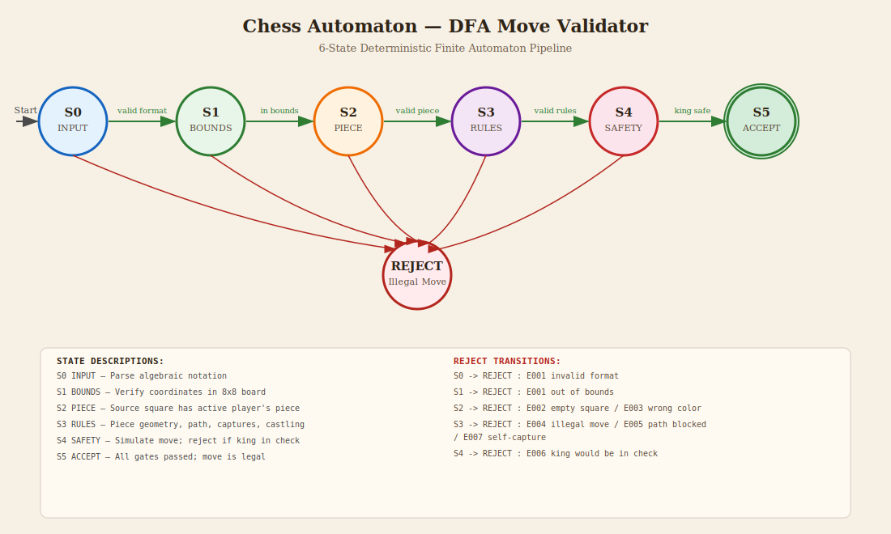

# ♟️ Automaton Chess Engine (CLI)

[](https://www.python.org/)
[]()
[]()

> A fully functional command-line chess game built in Python, implementing core chess mechanics through **Automata Theory** — centered on a deterministic finite automaton (DFA) move validator with visual execution traces.

---

## 🎯 Project Overview

This project was developed as a **1-week academic/technical challenge** to bridge theoretical computer science (automata theory) with practical software engineering. The centerpiece is a **DFA move validation pipeline** that deterministically checks every chess move through a sequence of gated states.

| Chess Concept | Automaton Equivalent | Implementation |
|-------------|---------------------|----------------|
| **Board Position** | DFA State | `board.py` — 8×8 grid state representation |
| **Legal Move Check** | DFA Transition δ | `main/DFA_move_validator.py` — deterministic validation pipeline |
| **Save/Load Games** | FEN State Encoding | `state_manager.py` — Forsyth-Edwards Notation |

---

## 🗂️ Project Structure

```
chess_automaton/
├── main.py                       # CLI entry point & game loop
├── board.py                      # Board state representation (DFA State)
├── pieces.py                     # Piece classes with move generators (DFA Transitions)
├── validator.py                  # Thin re-export: from main.DFA_move_validator import MoveValidator
├── game_engine.py                # State machine — turn management, special moves, undo
├── ai_engine.py                  # Minimax search with α-β pruning
├── state_manager.py              # FEN save/load persistence
├── utils.py                      # Notation parser, display helpers, coordinate conversion
├── README.md                     # This file
├── WRITE_UP.md                   # Deep-dive technical reference for the DFA validator
├── AGENTS.md                     # Coding agent guidance
└── main/                         # Subpackage: enhanced DFA validator + GUI + diagram generator
    ├── __init__.py               # Package init
    ├── DFA_move_validator.py     # ~1,484-line standalone validator (CLI + Tkinter GUI)
    ├── generate_dfa_diagram.py   # SVG diagram generator for the DFA pipeline
    ├── DFA_diagram.svg           # Generated visual diagram of the DFA states
    └── sample_position.fen       # Example FEN file
```

### File Responsibilities

| File | Lines | Purpose |
|------|-------|---------|
| `utils.py` | ~69 | Notation parser, ASCII renderer, coord conversion |
| `pieces.py` | ~218 | 6 piece classes with rule-based move generation |
| `board.py` | ~121 | 8×8 grid, FEN parser, state copying |
| `validator.py` | ~1 | Re-export of `MoveValidator` from `main.DFA_move_validator` |
| `game_engine.py` | ~267 | Turn management, special moves, undo/redo |
| `ai_engine.py` | ~205 | Minimax search, α-β pruning, evaluation |
| `state_manager.py` | ~123 | FEN encode/decode, file I/O |
| `main.py` | ~219 | CLI interface, menu system, command handler |
| `main/DFA_move_validator.py` | ~1,484 | Self-contained DFA validator, CLI/GUI |
| `main/generate_dfa_diagram.py` | ~260 | SVG generator for the DFA pipeline |

**Total: ~2,969 lines of Python**

---

## 🚀 Getting Started

### Prerequisites
- Python 3.8 or higher
- Terminal with Unicode support (for chess symbols)

### Installation

```bash
# Clone the repository
git clone https://github.com/yourusername/automaton-chess-engine.git
cd automaton-chess-engine

# No external dependencies required — uses only Python standard library!
```

### Running the Full Chess Game (CLI)

```bash
python main.py
```

### Running the Standalone DFA Validator (CLI)

```bash
# Default sample position
python main/DFA_move_validator.py

# Custom FEN file
python main/DFA_move_validator.py my_position.fen

# As a module
python -m main.DFA_move_validator my_position.fen
```

### Running the Standalone DFA Validator (GUI)

```bash
python main/DFA_move_validator.py --gui
python -m main.DFA_move_validator --gui my_position.fen
```

### Regenerating the DFA Diagram SVG

```bash
python main/generate_dfa_diagram.py
```
- Writes `main/DFA_diagram.svg`.

---

## 🎮 Controls & Commands

| Command | Alias | Action |
|---------|-------|--------|
| `e2e4` | — | Make a move (from square to square) |
| `e2-e4` | — | Alternative move format |
| `save` | `s` | Save current game to FEN file |
| `load` | `l` | Load game from FEN file |
| `undo` | `u` | Undo last move (and AI move if in AI mode) |
| `fen` | `f` | Display current FEN string |
| `board` | `b` | Redisplay the chess board |
| `help` | `h` | Show help menu |
| `quit` | `q` | Exit the game |

---

## 🧠 DFA Move Validator Deep Dive

The heart of the engine is a **deterministic finite automaton** that validates every chess move through a strict pipeline. The diagram below is the canonical reference for how a move string is processed.



> **6-state pipeline + explicit REJECT sink.** Each state is a deterministic gate. If a gate fails, the pipeline halts and the remaining states are marked "(skipped)". Only **S5 ACCEPT** is the accepting state.
>
> Regenerate this diagram anytime with `python main/generate_dfa_diagram.py`.

### Walking the States

| State | Gate | Accept Transition | Reject Transition | Error Code |
|-------|------|-------------------|-------------------|------------|
| **S0 INPUT** | Parse algebraic notation (`e2e4` or `e2-e4`) | `valid format` → S1 | `invalid format` → **REJECT** | E001 |
| **S1 BOUNDS** | Confirm both squares are inside the 8×8 board | `in bounds` → S2 | `out of bounds` → **REJECT** | E001 |
| **S2 PIECE** | Confirm the source square holds a piece of the active color | `valid piece` → S3 | `empty square` / `wrong color` → **REJECT** | E002 / E003 |
| **S3 RULES** | Apply piece-movement rules and special-move rules (castling, en passant) | `valid rules` → S4 | `illegal move` / `path blocked` / `self-capture` → **REJECT** | E004 / E005 / E007 |
| **S4 SAFETY** | Simulate the move; reject if the moving side's king would be in check | `king safe` → S5 | `king in check` → **REJECT** | E006 |
| **S5 ACCEPT** | All gates passed; the move is legal | — | — | — |

### Trace Output

On every validation attempt, the DFA produces a `trace` — a list of `(status, state_label, message)` tuples consumed by the CLI and GUI:

```
┌────────────────────────────────────────────────────┐
│         DFA MOVE VALIDATION TRACE                  │
├────────────────────────────────────────────────────┤
│  [✓] S0 INPUT   : "e2e4" parsed                    │
│  [✓] S1 BOUNDS  : e2 ∈ board, e4 ∈ board           │
│  [✓] S2 PIECE   : White Pawn at e2                 │
│  [✓] S3 RULES   : Pawn moves e2→e4 ✓               │
│  [✓] S4 SAFETY  : King safe after move             │
├────────────────────────────────────────────────────┤
│  ✓ ACCEPT — Move is LEGAL                          │
└────────────────────────────────────────────────────┘
```

On rejection, the trace shows exactly which state failed and why; skipped states are marked `(—, "(skipped)")`.

### FEN — Compact State Encoding

[Forsyth-Edwards Notation](https://en.wikipedia.org/wiki/Forsyth%E2%80%93Edwards_Notation) encodes a complete board state in ~80 characters:

```
rnbqkbnr/pppppppp/8/8/4P3/8/PPPP1PPP/RNBQKBNR w KQkq e3 0 1
│           │           │    │    │    │    │
│           │           │    │    │    │    └── Fullmove number
│           │           │    │    │    └────── Halfmove clock (50-move rule)
│           │           │    │    └─────────── En passant target square
│           │           │    └──────────────── Castling rights (KQkq)
│           │           └────────────────────── Active color (w/b)
│           └────────────────────────────────── Piece placement (8 rows)
└──────────────────────────────────────────── Row 8: rnbqkbnr
```

---

## 📖 Function Reference

### `main.py` — CLI Entry Point

| Function | Description |
|----------|-------------|
| `print_banner()` | Prints the ASCII title banner at startup. |
| `print_help()` | Displays the command reference and special-move instructions. |
| `get_promotion_choice()` | Prompts the user to choose a promotion piece (`q`/`r`/`b`/`n`). Defaults to Queen. |
| `main()` | **Main game loop.** Sets up the engine, selects game mode, configures AI depth, then loops: AI turn → human input → command dispatch → move validation → board display. Handles `quit`, `help`, `board`, `fen`, `undo`, `save`, `load`, and move parsing. |

**Key behavior:**
- On `undo` in AI mode, undoes twice to revert both the AI's move and the player's move.
- On `load`, resets the move log and recreates the validator so the loaded board is fully synchronized.
- Detects pawn promotion by checking if a Pawn reaches the final rank before calling `engine.make_move()`.

---

### `main/DFA_move_validator.py` — Standalone DFA Validator

This ~1,484-line module is intentionally **self-contained**. It re-implements board logic, piece classes, and the full DFA validation pipeline so it can run standalone for educational demonstration.

#### Helper Functions

| Function | Description |
|----------|-------------|
| `square_to_coords(square)` | Converts algebraic notation (`e4`) to zero-based `(row, col)`. Returns `None` on invalid input. |
| `coords_to_square(row, col)` | Converts `(row, col)` back to algebraic notation. Returns `None` if out of bounds. |
| `parse_move_input(move_str)` | Parses `e2e4` or `e2-e4` into `((from_r, from_c), (to_r, to_c))`. Uses regex `([a-h][1-8])-?([a-h][1-8])`. |
| `piece_title(piece)` | Returns a human-readable label like `"White Pawn"`. |
| `piece_symbol(piece_type, color)` | Returns the correct Unicode chess symbol (e.g., `♔`, `♚`). |

#### Piece Classes

All inherit from `Piece(color, piece_type)` and implement `get_possible_moves(row, col, board)`.

| Class | Key Logic |
|-------|-----------|
| `Pawn` | Forward 1, forward 2 from start rank, diagonal capture, en passant detection via `board.en_passant_target`. |
| `Knight` | 8 L-shaped offsets; can jump over pieces. |
| `Bishop` | Diagonal `_slide()` along 4 directional vectors. |
| `Rook` | Orthogonal `_slide()` along 4 directional vectors. |
| `Queen` | Reuses `Bishop._slide()` + `Rook._slide()` combined. |
| `King` | 1 square any direction; castling (2-square horizontal) when rights, rook, and path are valid. |

#### `Board` Class

| Method | Description |
|--------|-------------|
| `from_fen(fen_string)` | Class method. Parses a FEN string into a fully populated `Board` instance including piece placement, active color, castling rights, en passant target, halfmove clock, and fullmove number. |
| `load_from_file(filename)` | Class method. Reads the first line of a file as FEN and calls `from_fen()`. |
| `copy()` | Deep-copies the board, preserving grid state, piece `has_moved` flags, castling rights, en passant target, and clock counters. |
| `get_piece(row, col)` | Returns the piece at `(row, col)` or `"."` if empty. |
| `set_piece(row, col, piece)` | Places a piece on the grid. |
| `find_king(color)` | Scans the grid to locate the king of the given color. |
| `display()` | Returns a Unicode ASCII art board with rank/file labels. |
| `apply_move(from_coords, to_coords)` | Executes a move, updates `has_moved`, handles castling rook movement, en passant capture, pawn promotion (auto-Queen), and revokes castling rights when king or rooks move. |

#### `MoveValidator` Class — The DFA Engine

| Method | Description |
|--------|-------------|
| `validate(move_str)` | **Full 6-state DFA pipeline.** Returns `(is_valid, trace, error_msg)`. Stages: S0 INPUT (parse) → S1 BOUNDS → S2 PIECE (color check) → S3 RULES (piece geometry) → S4 SAFETY (king check simulation) → S5 ACCEPT. On first failure, halts and marks remaining states as "(skipped)". |
| `is_valid_move(from_coords, to_coords)` | Programmatic shortcut; no string parsing, no trace. Returns boolean. |
| `simulate_move(from_sq, to_sq)` | Returns a copied `Board` with the move applied (used for king-safety simulation). |
| `is_king_in_check(board, color)` | Checks whether the king of `color` is under attack on the given board. |
| `is_in_check(color)` | Convenience wrapper using the validator's current board. |
| `has_any_legal_moves(color)` | Returns `True` if `color` has at least one legal move in the current position. |
| `get_all_legal_moves(color)` | Generates every `((from_r, from_c), (to_r, to_c))` that passes all DFA stages. |
| `_validate_rules(from_coords, to_coords, piece)` | Delegates to piece-specific validators (`_validate_pawn_move`, `_validate_slider_move`, `_validate_king_move`). |
| `_would_leave_king_in_check(from_coords, to_coords, piece)` | Simulates the move on a copied board and returns `True` if the moving side's king would be in check. |
| `_is_square_attacked(board, row, col, defending_color)` | Checks if any opponent piece attacks `(row, col)`. |

#### Trace Rendering & Entry Points

| Function / Class | Description |
|------------------|-------------|
| `render_trace(trace, accepted, ...)` | Builds the boxed ASCII trace output with Unicode box-drawing characters. |
| `normalize_trace(trace)` | Ensures all 5 DFA states appear in the trace map; missing states become `(—, "Awaiting traversal")`. |
| `summary_text(accepted, ...)` | One-line result summary for CLI and GUI surfaces. |
| `run_cli(fen_path)` | Loads a position, prints the board, and loops reading moves. On each input, runs `MoveValidator.validate()`, prints the boxed trace, and (if legal) applies the move. Accepts `quit` to exit. |
| `DfaTraversalApp` | **Tkinter GUI class.** Multi-panel interface: board grid, move input, DFA stepper canvas, state details, rendered trace box, and move history. Colors nodes green (✓), red (✗), or gray (—) and refreshes dynamically. |
| `run_gui(fen_path)` | Lazily imports `tkinter`, creates the root window, instantiates `DfaTraversalApp`, and starts `mainloop()`. |
| `parse_args(argv)` | Parses `--gui` flag and optional FEN file path from command-line arguments. |
| `main(argv)` | Dispatches to `run_gui()` or `run_cli()` based on parsed arguments. |

---

## 🧪 Testing & Validation

The engine has been tested against:
- ✅ Standard starting position (all 20 legal opening moves)
- ✅ Castling (kingside & queenside, with rights validation)
- ✅ En passant capture
- ✅ Pawn promotion
- ✅ Check detection (discovered checks, double check)
- ✅ Checkmate and stalemate recognition
- ✅ 50-move rule implementation
- ✅ FEN round-trip consistency (save → load produces identical state)

---

## 📚 Documentation

| File | Audience | Contents |
|------|----------|----------|
| `README.md` | Human users | Project overview, features, getting started, DFA diagram |
| `WRITE_UP.md` | Developers | Deep-dive technical reference for `main/DFA_move_validator.py`, including the DFA pipeline, error codes, class reference, and usage examples |
| `AGENTS.md` | AI coding agents | Architecture, conventions, and practical guidance |
| `main/AGENTS.md` | AI coding agents | Subpackage-specific guidance for the standalone DFA validator |

---

## 🔮 Future Enhancements

- [ ] Opening book integration (precomputed DFA transitions)
- [ ] Endgame tablebases (perfect play for ≤7 pieces)
- [ ] Iterative Deepening Search (IDS)
- [ ] Transposition tables (FEN-based hashing)
- [ ] UCI protocol support (play against other engines)
- [ ] GUI using `curses` or `pygame`
- [ ] Neural network evaluation (replace weighted evaluation)

---

## 📄 License

This project is licensed under the MIT License.

---

## 🙏 Acknowledgments

- Built as a 1-week sprint project for automata theory coursework
- Inspired by classical chess engine architecture (Stockfish, Crafty)
- FEN specification based on [Forsyth-Edwards Notation standard](https://www.chessprogramming.org/Forsyth-Edwards_Notation)

---

<div align="center">

**Made with ♟️ and automata theory**

[⬆ Back to Top](#-automaton-chess-engine-cli)

</div>
